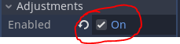
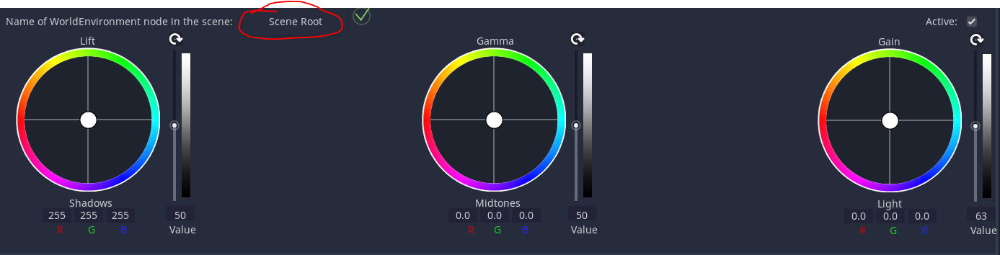
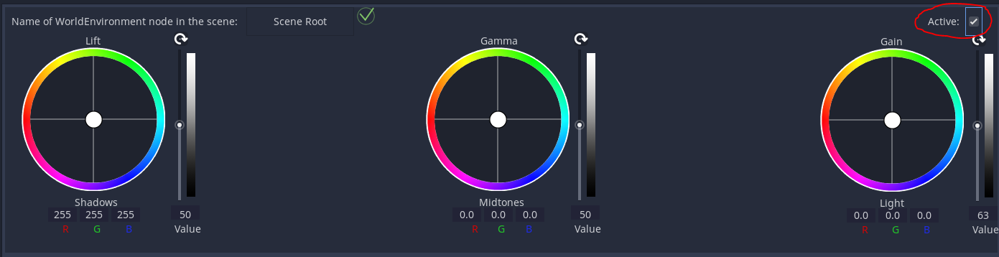

# LIFT GAMMA GAIN PLUGIN for Godot

## What is this plugin? 

Lift gamma gain plugin, is a plugin made to achieve a good and fast post processing effect on your game. 

## How to use the plugin
It is quite simple: 
* Download and extract the project's zip
* Copy the "addons" folder in your project folder 
* Activate the Lift Gamma Gain plugin on Godot 
* Now be sure you have the **World environment** node in your tree 
* Click on your **World environment** node and enable the **Adjustment** option, as in picture below:

* Open the tab of the plugin (you will find it on the bottom, where there are the Output, Debug and etc...) 
* Now you need to write the name of the **World environment** node if is different compared with default one of the plugin  (in my case the name of world environment was Scene Root)

* At last click on the checkbox **Active**

* If all things went well you will see a nice green symbol beside the text box (like the photo above)
* **ET VOILA'** now you can use the plugin :) 

## The plugin dark future 
I hope you all will forgive me but I don't know if I will continue thw work with this plugin or even I will fix its problems
I hope that plugin will inspire some other users to do a better plugin than this.

## Credits
Thank to zachsaw, I wrote my code on his script (https://github.com/zachsaw/RenderScripts/blob/master/RenderScripts/ImageProcessingShaders/SweetFX/LiftGammaGain.hlsl)
and thank to my two friends who helped me: Nicolò and Thereis
